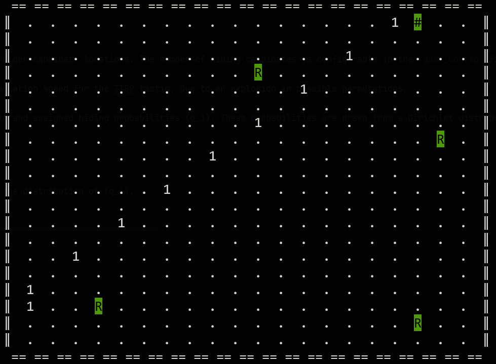

# Simple drone swarm simulator in adversarial hide & seek environment
<p align="center">

</p>

___
## Game info

### Hider
The game features a single static hider, which can be placed in one of n<sub>hider_candidates</sub> locations. The number of hiding candidates is configurable in the `game_config` file.

Note that setting more than 10 hider candidates significantly impacts simulation speed for the TTBP tactic, due to an explosion in possible permutations.

At initialization, the candidate cells are randomly selected from the grid and assigned hiding probabilities (q<sub>i</sub>). These probabilities are drawn from a Dirichlet distribution, which guarantees: $\sum^{hidercandidates}_{i=1}q_i=1$.

The current implementation provides two hiding strategies:
Greedy
: The hider always selects the cell with the highest (q<sub>i</sub>).

Weighted
: The hider selects a cell probabilistically, according to the distribution of (q<sub>i</sub>).

###### About the dirichlet distribution alpha value:
In the implementation the definition of the dirichlet distribution alpha is slightly adjusted. 
The main code shows alpha as a scalar to control spread, in the 'Dist' class alpha is adjusted to be a 1-dimensional array filled with the scalar value. 
By default, the alpha scalar is set to 2. 
Meaning that with two hider candidates the resulting hiding probabilities, q<sub>1</sub> and q<sub>2</sub>, will be approximately 0.5 each. 
If one want to preserve an even distribution as the number of hider candidates increases, alpha should scale with it. 
If alpha is kept fixed instead the resulting distribution becomes more spread out.


### Risks
Each hider cell has some associated risk with it, **p<sub>i</sub>**.</br>
p<sub>i</sub> is the probability that an individual drone will be taken down upon entering the cell, the p<sub>i</sub> thus does not necessarily directly affect the swarm.
This means that if the drone enters the cell, and is taken down, it will not be able to find the hider even if the hider is located in the cell that the drone just entered.

The risk probabilities or risk chances are set in the `game_config` file:

```python
RISK_CHANCES = [1/10,1/9,1/8,1/7,1/6,1/5,1/4,1/3]
```
For each hider candidate a random sample is *drawn with replacement* from this `risk_chances` list.


### Swarm & Drones
The swarm operates in a square grid environment which can be dynamically assigned in the `game_config`.
The first game-step or simulation step is the swarm entering the grid on position x,y = 0,0;
</br> The swarm operates under the following restrictions and assumptions:
- Drones in a swarm **cannot move diagonally**;
- Drones in a swarm **know possible hiding 'candidates'** (cells where the hider might be hidden);
- Drones in a swarm **are aware of the risks** the hiding candidates have (**p<sub>i</sub>**).
- Drones in a swarm **are not aware of the hiding chances** the hiding candidates have (**q<sub>i</sub>**);


___ 

## Use:
Run directly from command line:

```sh
main.py --plot --tactic <tactic> --runs <nruns> --log
```
| CMD               |                    Explanation                    |
|:------------------|:-------------------------------------------------:|
| --plot            |  Enables printed visualisation simulation runs.   |
| --tactic <tactic> |      Specify which searching tactic to use.       |
| --runs <nruns>    |      Specify the amount of simulation runs.       |
| --log             | Enables logging to csv file in sim_logs directory |
| --plotspeed       | increase plot interval time must be > 0           | 

## List of available tactics:

| Name                                  | Abbreviation |
|:--------------------------------------|-------------:|
| Together Traverse to Best Permutation |     **ttbp** |
| Divide Over Risks                     |      **dor** |
| Partitioned Horizontal Scan           |      **phs** |
| Horizontal Scan                       |       **hs** |
| Vertical Scan                         |       **vs** |
| Random                                |     **rndm** |


### Recommended use:
Using --plot drastically slows down the simulation speed, as every step in the simulation something will be printed to console. Hence, the advise is to only use this when you want to visualise what is going on for demonstration or debugging purpose.


The simulation environment uses the NetworkX module as a backbone for calculating shortest paths, one can enable  
RAPIDS nx-cugraph to make sure NetworkX is brought to full potential, this is a GPU Accelerated NetworkX Backend.
You can remove this line from main.py or simply put it to False if you don't want to deal with installing NX_CUGRAPH. 
```python
NX_CUGRAPH_AUTOCONFIG=True
```
In terms of efficiency it does not make a big difference anyway, as with the current implementation the complete set of all shortest routes is only calculated once and then cached. Thus theoretically the main optimization that can be done here is with the initialization of the simulation.  
More about NX_CUGRAPH:
https://rapids.ai/nx-cugraph/
